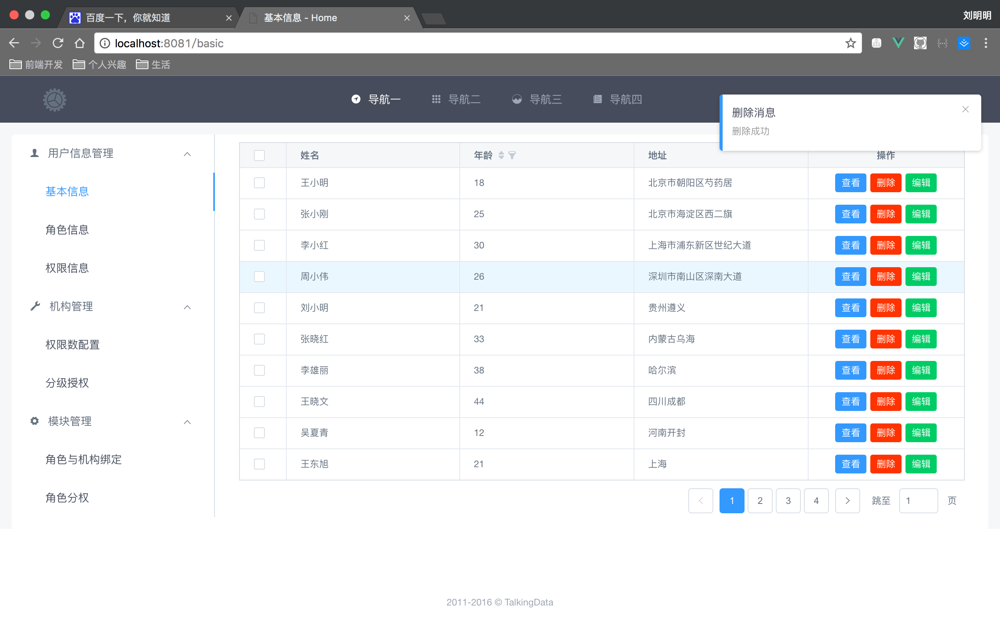

# iView-project

This project is build for Vue.js 2 + vue-router + vue-resource + webpack2 + iView 2, just install and run.

## preview



## Install
```bush
// install dependencies
npm install
```
## Run
### Development
```bush
// run server
npm run dev
```
### Production(Build)
```bush
npm run build
```

